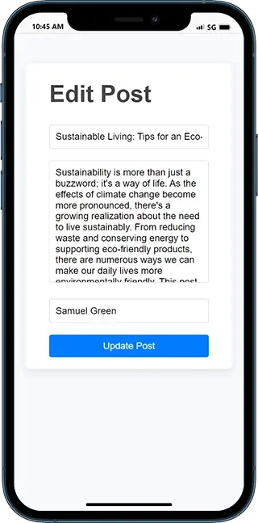
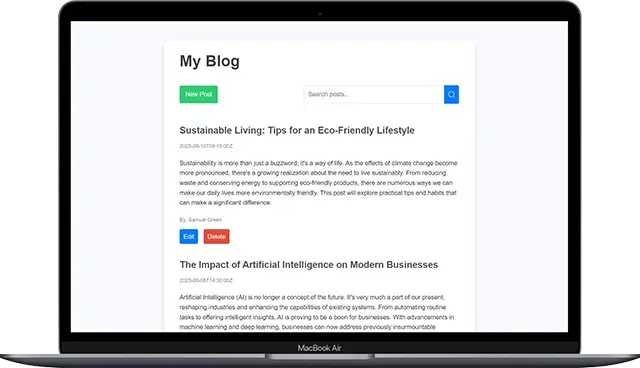

# Blog API Project

This project setups a private RESTful API to manage (Create/Read/Update/Delete) blog posts. Data is stored locally and persisted between server restart via a JSON file.

It also setups a web application that renders dynamic HTML content to the client (SSR) and interacts with the blog API. On the frontend, a mobile-first and responsive UI allows the user to manage its blog posts.

## Table of contents

- [Screenshots](#screenshots)
- [Getting started](#getting-started)
- [Built with](#built-with)
- [Author](#author)

## Screenshots

- Mobile:

  
  

- Laptop/Desktop:

  
  

## Getting started

1. Clone the project and run the following command:

```console
yarn install
```

This will initialize the project by installing all the required dependencies.

2. Start the development server:

```console
yarn run dev
```

3. Start the production server:

```console
yarn run start
```

## Built with


- Node.js, Express.js and TypeScript for the blog API, server and web application
- EJS as templating engine for SSR
- Axios as a promise-based HTTP Client
- Zod as a TypeScript-first schema declaration and validation library
- Vite as frontend tooling
- Vitest as TypeScript unit testing framework

## Author

- Github - [ddZ6ii](https://github.com/ddZ6ii)
- Linkedin - [denis-dezest](https://www.linkedin.com/in/denis-dezest/)
